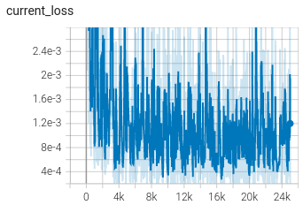
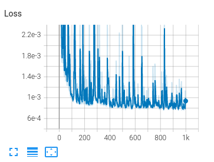

# SRCNN

<hr/>

### Introduction
This repository is part of CS7180 Advanced Perception course at Northeastern University. This is Assignment-1, Image Sharpening aimed at exploring Super Resolution techniques. We implement SRCNN in pytorch from scratch and try to swap the MSE loss with perceptual loss.


<hr/>

### Some random outputs:


### Training on Div2k

Follow these steps to train on Div2k dataset.

```
git clone https://github.com/prajapatisarvesh/SRCNN-Pytorch.git # Clone this repo
cd SRCNN-Pytorch
cd utils
### Download the dataset and prepare the CSV
python3 div2k_downloader.py
cd ..
python3 train.py
```

This should start training, tensorboard is enabled, and checkpoints are being saved after every epoch. Argument Parsing is one thing we want to add some point in time.

<hr/>

### Testing on Div2k

Some baseline checkpoints are provided with this model, these are our baselines, and you can test them with color images of any dimension. 

```
cd SRCNN-Pytorch
python3 test.py # This should save output in output dir.
```

<hr/>

### Training visulaization on Tensorboard

 

</hr>

### Acknoledgement

Thanks to this amazing repository that taught us some good practices to work with Pytorch -- [Pytorch-Template](https://github.com/victoresque/pytorch-template). This repo will have lot's of improvement, we will keep updating this.